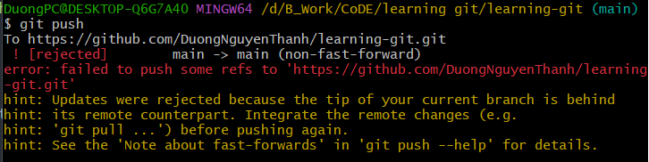
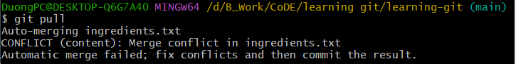
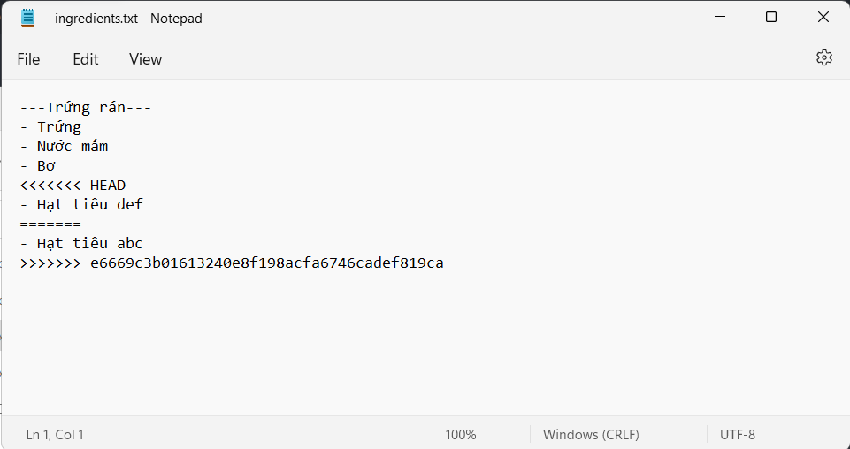
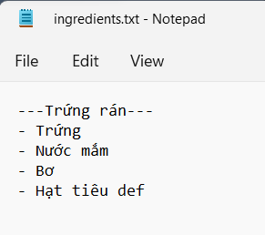
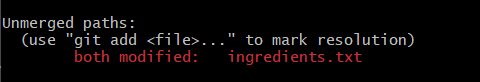
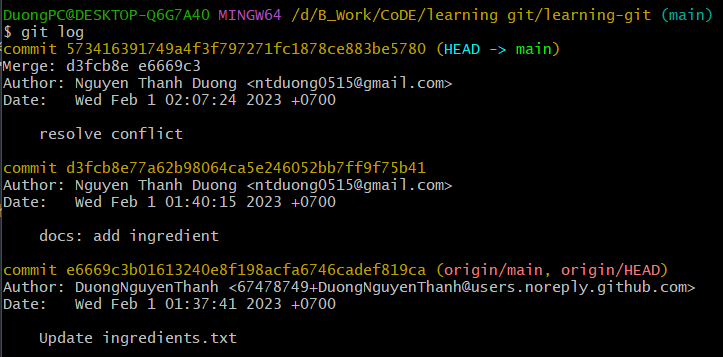
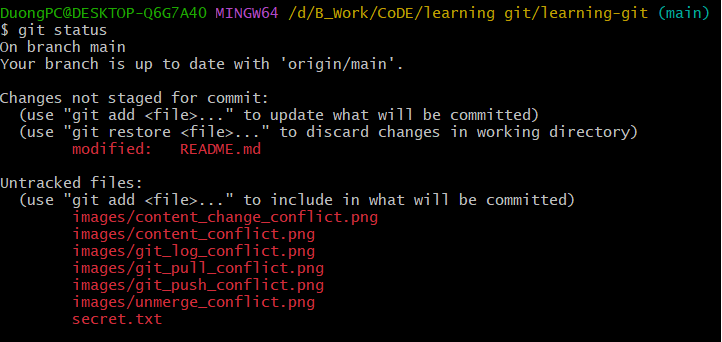
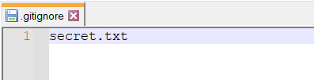
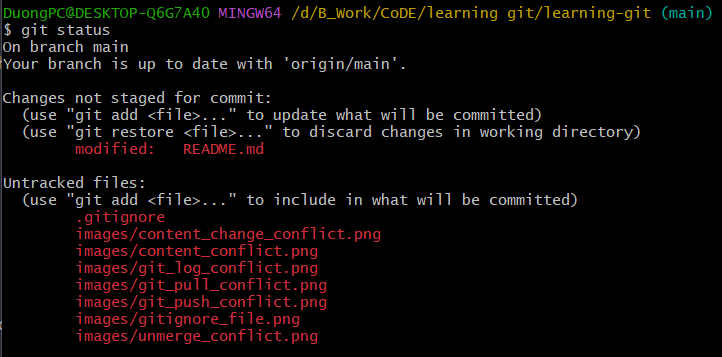

# learning-git

## Git
Git là một hệ thống quản lý phiên bản phân tán.

## Git Config
```
git config --global user.name 'Duong'
git config --global user.email 'duong@gmail.com'
```

## Repository
Repository (kho chứa) là nơi sẽ ghi lại trạng thái của thư mục và file. Trạng thái được lưu lại đang được chứa như là lịch sử thay đổi của nội dung. Một người khác có thể sao chép (clone) lại mã nguồn đó nhằm làm việc.

Repository có hai loại là Local Repository (Kho chứa trên máy cá nhân) và Remote Repository (Kho chứa trên một máy chủ từ xa).

## Git status
```
git status
```
Cho biết được trạng thái của các file trong thư mục

## Staging Area
Staging Area nghĩa là một khu vực mà nó sẽ được chuẩn bị cho quá trình commit. Trước hết, ta cần phải hiểu rằng trong các hệ thống quản lý phiên bản (Version Control System) thì các dữ liệu sẽ được lưu trữ ở hai nơi, một là thư mục ta đang làm việc trên máy tính (working tree) và một là kho chứa mã nguồn (repository) sau khi ta đã thực hiện thay đổi (ví dụ như kho chứa trên Github).

Nhưng với Git thì nó có thêm một lựa chọn nữa đó là có thêm một khu vực trung gian gọi là Staging Area và đây chính là một lợi thế lớn của Git. Staging Area nghĩa là khu vực sẽ lưu trữ những thay đổi của ta trên tập tin để nó có thể được commit, vì muốn commit tập tin nào thì tập tin đó phải nằm trong Staging Area. Một tập tin khi nằm trong Staging Area sẽ có trạng thái là Stagged.


Và để đưa một tập tin vào Staging Area thì ta sẽ cần phải sử dụng lệnh git add tên_file.

## Git log
```
git log
```
Xem lại các commit mà chúng ta đã tạo.

## Commit là gì và nó hoạt động ra sao?
Hiểu đơn giản hơn, commit nghĩa là một hành động để Git lưu lại một bản chụp (snapshot) của các sự thay đổi trong thư mục làm việc, và các tập tin và thư mục được thay đổi đã phải nằm trong Staging Area. Mỗi lần commit nó sẽ được lưu lại lịch sử chỉnh sửa của mã nguồn kèm theo tên và địa chỉ email của người commit. Ngoài ra trong Git bạn cũng có thể khôi phục lại tập tin trong lịch sử commit của nó để chia cho một phân nhánh (branch) khác, đây là mấu chốt của việc bạn sẽ dễ dàng khôi phục lại các thay đổi trước đó.

Lệnh commit trong Git sẽ là: 
```
git commit -m “Lời nhắn”
```

Và nếu bạn muốn đưa tập tin lên repository thì bạn phải commit nó trước rồi sau đó lệnh ```git push origin master``` sẽ có nhiệm vụ đưa toàn bộ các tập tin đã được commit lên repository.

## Điều kiện gì để commit một tập tin?
Nếu bạn muốn commit một tập tin đó, bạn sẽ cần phải đưa tập tin đó vào trạng thái tracked bằng lệnh git add tên_file. Trong git có hai loại trạng thái chính đó là Tracked và Untracked, cụ thể:

`Tracked` – Là tập tin đã được đánh dấu theo dõi trong Git để bạn làm việc với nó. Và trạng thái Tracked nó sẽ có thêm các trạng thái phụ khác là: 
- Unmodified (chưa chỉnh sửa gì).
- Modified (đã chỉnh sửa).
- Staged (đã sẵn sàng để commit). 

`Untracked` – Là tập tin còn lại mà bạn sẽ không muốn làm việc với nó trong Git.

Nhưng bạn phải nên biết rằng nếu tập tin đó đã được Tracked nhưng đang rơi vào trạng thái (Modified) thì nó vẫn sẽ không thể commit được mà bạn phải đưa nó về Staged cũng bằng lệnh git add.

## Đưa một file từ staging area quay về working directory
```
git restore --staged <tên-file>
```

## Git branch
```
git branch
```
Hiển thị tất cả các branch đang có trong git repo của chúng ta.

### Tạo branch dựa trên branch main:
```
git checkout -b <tên-branch>
```
Ví dụ: main có 3 commit, sau khi ta gọi `git checkout -b body-style` thì sẽ thêm branch mới là body-style có 3 commit đó. Nếu có commit mới thì commit đó chỉ nằm trên branch body-style chứ không động chạm gì tới branch main.

### Chuyển sang branch khác
```
git checkout <tên-branch-khác-đã-tồn-tại>
```

## Merge
Chúng ta nằm tại branch main
```
git merge <tên-branch-cần-merge>
```
Ví dụ: main và branch body-style
Sau khi merge nó sẽ đưa những commit mới nhất ở trên body-style vào main

Sau khi merge thì main sẽ có thêm 1 commit mới ở dưới local. Ta phải `git push` để nó up lên remote. 

## Quay về phiên bản các commit trước
Sử dụng `git log` để hiển thị ra các commit đã tạo. Nó sẽ hiển thị các commit tương ứng với các commit hash.

Giờ ta muốn quay lại commit nào đó thì:
```
git checkout <commit-hash>
```
Ví dụ: `git checkout cc02f6e3754c612a34ac18cf04707e831e9675ed`

Quay về phiên bản trước thì nó sẽ tạo cho chúng ta 1 branch mới. Nếu muốn quay về ban đầu thì ta chỉ việc `git checkout <branch-ban-đầu>`

## Xử lý CONFLICT
Ví dụ: 
File ingredient.txt trên remote chỉnh sửa dòng số 4 thành abc. Dưới local ta sửa dòng số 4 thành def.

Sau khi sửa dưới local ta dùng lệnh `git status` để kiểm tra.
Sau khi kiểm tra ta dùng lệnh `git add` và `git commit` như bình thường rồi `git push`.
Nó sẽ có kết quả như sau:



Lý do là phiên bản dưới local đang có sự khác biệt so với remote nên chúng ta phải `git pull` để đưa phiên bản mới nhất trên remote về local.

Khi pull về hệ thống phát hiện dòng số 4 trên remote và dòng số 4 trên local đang được chỉnh sửa. Dễ hiểu là các phiên bản đang sửa chung trên dùng 1 dòng -> do đó xảy ra confilct.





- HEAD là hiển thị những commit mới nhất ở trên local.
- Phía dưới là commit ở phía trên remote.
Nó sẽ hiển thị cho chúng ta biết là ta sẽ chọn những thay đổi ở local hay chọn những thay đổi ở trên remote.

Sau khi thống nhất với người commit ở trên remote và chọn thay đổi nào thì chỉ việc xóa thay đổi kia đi là được (xóa bằng tay).



Sau khi mà ta giải quyết được conflict thì ta phải tạo một commit để lưu lại cái việc giải quyết conflict này.

Chúng ta gõ `git status` để kiểm tra.


Hệ thống báo file ingredient.txt chưa được merge (unmerge).

Để merge thì đơn giản chúng ta sẽ gõ: 
```
git add ingredient.txt
``` 
rồi 
```
git commit -m "resolve conflict"
```

Gõ `git log` để kiểm tra ta có kết quả:


Chúng ta sẽ có thêm 2 commit mới là commit "add ingredient" sửa thành "Hạt tiêu def" và commit "resolve conflict" để xử lý conflict giữa thằng "Update ingredients.txt" và "add ingredient".

Xong xuôi ta chỉ việc `git push` là cập nhật lên remote thành công.

## Gitignore
Có những file ta không muốn hiển thị lịch sử lên trên repo thì ta sử dụng gitignore.

Ví dụ ta có file mới là secret.txt:


Ta không muốn nó hiển thị lên thì ta chỉ việc tạo 1 file mới là `.gitignore` rồi thêm tên file muốn ẩn vào gitignore.





Sau khi commit thì hệ thống chỉ lưu lại lịch sử thay đổi của file .gitignore chứ không hiển thị thay đổi của file secret.txt.

## Conventional Commits
### Chuẩn cấu trúc conventional commits
```
# [] là phần tùy chọn, có thể có hoặc không, <> là phần bắt buộc 
<type>[optional scope]: <description>

[optional body]

[optional footer(s)]
```

`type`:
- **fix**: pull request này thực hiện fix bug của dự án.
- **feat(feature)**: pull request này thực hiện một chức năng mới của dự án.
- **refactor**: pull request này thực hiện refactor lại code hiện tại của dự án (refactor hiểu đơn giản là việc "làm sạch" code, loại bỏ code smells, mà không làm thay đổi chức năng hiện có).
- **docs**: pull request này thực hiện thêm/sửa đổi document của dự án.
- **style**: pull request này thực hiện thay đổi UI của dự án mà không ảnh hưởng đến logic.
- **perf**: pull request này thực hiện cải thiện hiệu năng của dự án (VD: loại bỏ duplicate query, ...).
- **vendor**: pull request này thực hiện cập nhật phiên bản cho các packages, dependencies mà dự án đang sử dụng.
- **chore**: pull request này để chỉ những thay đổi không đáng kể trong code (thay đổi lặt vặt - ví dụ như thay đổi text).

`scope`:
- **KHÔNG BẮT BUỘC**
- Thay đổi code trong pull request này sẽ có phạm vi ảnh hưởng đến đâu (là danh từ)
- Đứng ngay sau `<type>` và được đặt trong dấu ngoặc đơn.

```
# scope ở đây là lang (language)
feat(lang): add polish language
```
(ví dụ nếu thực hiện sửa đổi phần xác thực người dùng thì scope là (authentication) )

`description`: mô tả khá quát, ngắn gọn về những thay đổi được thực hiện trong pull request.

```
# mô tả ngắn gọn pull request này sửa lỗi chính tả trong CHANGELOG
docs: correct spelling of CHANGELOG
```

`body`:
- **KHÔNG BẮT BUỘC**
- NẾU CÓ, bắt buộc phải cách phần `description` 1 dòng trắng (blank line)
- Mô tả chi tiết bổ sung cho phần description phía trên về những thay đổi được thực hiện trong pull request.
- Không giới hạn về số dòng và không nhất thiết phải theo 1 format nhất định (free-form).

`footer(s)`:
- KHÔNG BẮT BUỘC
- Nằm ở phía sau body (nếu có body) và phân cách bằng một dòng trắng (blank line)
- Chứa các thông tin mở rộng của pull request ví dụ như là danh sách người review, link/id của các pull request có liên quan.
- Nếu có nhiều footer thì mỗi footer phải chứa một word token là :<space> hoặc <space>#
- Để phân biệt với phần body thì các từ ghép dùng làm token (ngoại trừ BREAKING CHANGE) sẽ ngăn cách nhau bằng dấu - thay vì <space> (Reviewed by => Reviewed-by)

```
# 1 commit message gồm body(gồm nhiều đoạn) và nhiều footer 
fix: correct minor typos in code #type: description

see the issue for details #body paragraph 1

on typos fixed. #body paragraph 2

Reviewed-by: Z #footer 1 sử dụng :<space>
Refs #133 #footer 2 sử dụng <space>#
```

`BREAKING CHANGE` (quan trọng nên cần viết IN HOA và **bôi đậm**):
- Nếu sự thay đổi code trong pull request của bạn làm thay đổi lớn khiến cho nó không còn tương thích với phiên bản trước nữa thì bạn sẽ phải đánh dấu pull request này là BREAKING CHANGE.
- Có 2 cách để đánh dấu 1 pull request là BREAKING CHANGE: đó là đặt từ khóa BREAKING CHANGE: vào đầu footer hoặc là ! liền sau type/scope hoặc sử dụng cả 2.

```
# sử dụng từ khóa `BREAKING CHANGE`
feat: allow provided config object to extend other configs
<blank line>
BREAKING CHANGE:<space>`extends` key in config file is now used for extending other config files

# sử dụng ! liền sau type trong commit
refactor!: drop support for Node 6

# sử dụng kết hợp cả 2 
refactor!: drop support for Node 6
<blank line>
BREAKING CHANGE:<space>refactor to use JavaScript features not available in Node 6.
```